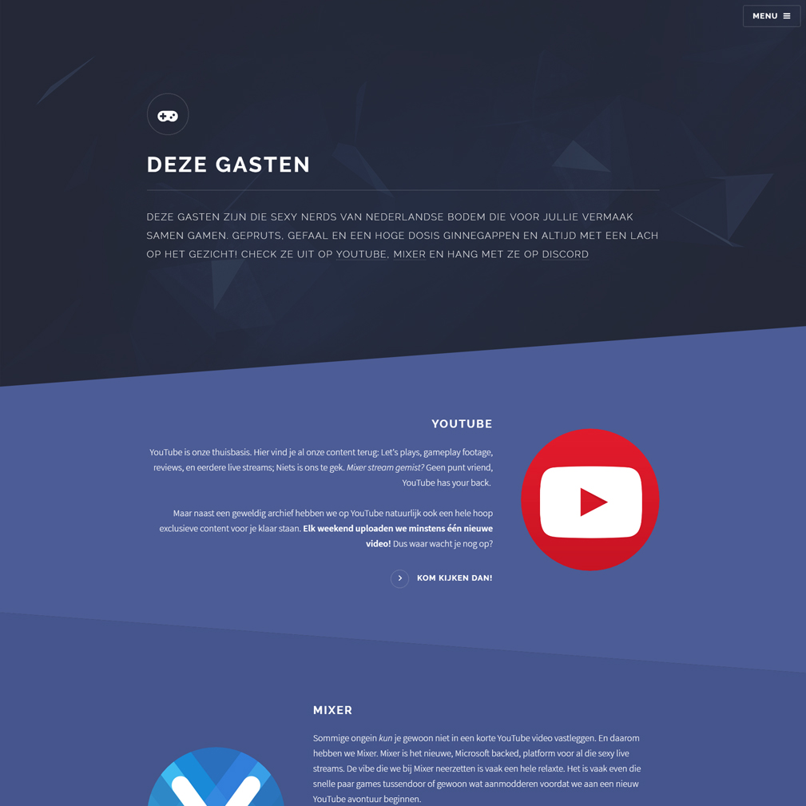

  

# Solid State

This theme is a port of the [Solid State HTML Template](http://html5up.net/solid-state) developed by [HTML5UP](http://html5up.net/) and ported to [Grav](http://getgrav.org) by Giansimon Diblas. This theme has then been further optimized and debugged by Bonno van der Basch. A working example can be seen on the website [Deze Gasten](http://dezegasten.nl)

# Installation

Installing this theme can be done in one of two ways. Our GPM (_Grav Package Manager_) installation method enables you to quickly and easily install the theme with a simple terminal command, while the manual method enables you to do so via a zip file.

## GPM Installation (_Preferred_)

The simplest way to install this theme is via the [Grav Package Manager (GPM)](http://learn.getgrav.org/advanced/grav-gpm) through your system's Terminal (_also called the command line_).  From the root of your Grav install type:

    bin/gpm install solid-state

This will install this theme into your `/user/themes` directory within Grav. Its files can be found under `/your/site/grav/user/themes/solid-state`.

## Manual Installation

To install this theme, just download the zip version of this repository and unzip it under `/your/site/grav/user/themes`. Then, rename the folder to `solid-state`. You can find these files either via [GetGrav.org](http://getgrav.org/downloads/themes).

You should now have all the theme files under

    /your/site/grav/user/themes/solid-state

# Updating

As development for this theme continues, new versions *may* become available that add additional features and functionality, improve compatibility with newer Grav releases, and generally provide a better user experience. Updating this theme is easy, and can be done through Grav's GPM system, as well as manually.

## GPM Update (_Preferred_)

The simplest way to update this theme is via the [Grav Package Manager (GPM)](http://learn.getgrav.org/advanced/grav-gpm). You can do this with this by navigating to the root directory of your Grav install using your system's Terminal (_also called command line_) and typing the following:

    bin/gpm update solid-state

This command will check your Grav install to see if this theme is due for an update. If a newer release is found, you will be asked whether or not you wish to update. To continue, type `y` and hit `enter`. The theme will automatically update and clear Grav's cache.

## Manual Update

Manually updating this theme is pretty simple. Here is what you will need to do to get this done:

* Delete the `your/site/user/themes/solid-state` directory.
* Download the new version of the this theme from either via [GetGrav.org](http://getgrav.org/downloads/themes).
* Unzip the zip file in `your/site/user/themes` and rename the resulting folder to `solid-state`.
* Clear the Grav cache. The simplest way to do this is by going to the root Grav directory in terminal and typing `bin/grav clear-cache`.

> Note: Any changes you have made to any of the files listed under this directory will also be removed and replaced by the new set. Any files located elsewhere (_for example a YAML settings file placed in_ `user/config/themes`) will remain intact.

# Setup

If you want to set this theme as the default theme, you can do so by following these steps:

* Navigate to `/your/site/grav/user/config`.
* Open the **system.yaml** file.
* Change the `theme:` setting to `theme: solid-state`.
* Save your changes.
* Clear the Grav cache. The simplest way to do this is by going to the root Grav directory in Terminal and typing `bin/grav clear-cache`.

Once this is done, you should be able to see the new theme on the frontend. Keep in mind any customizations made to the previous theme will not be reflected as all of the theme and templating information is now being pulled from the **tessellate** folder.
